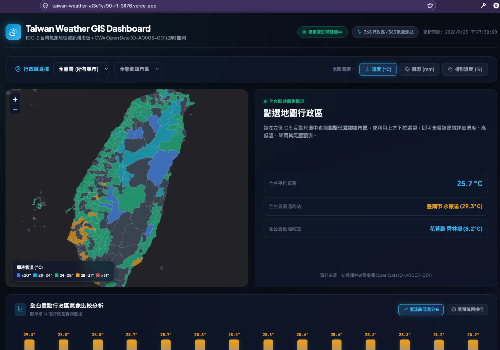

# Taiwan Weather GIS Dashboard 🌦️🗺️
> **IDC-2 台灣氣象地理資訊儀表板**：整合中央氣象署（CWA）Open Data 與全台行政區 GIS 向量圖資的互動式氣象觀測 Web 應用系統。


[](https://taiwan-weather-al3c1yv90-r1-3876.vercel.app/)

---

### 🌐 線上展示與系統預覽 (Live Demo)

> **🚀 線上即時體驗網址**：[**https://taiwan-weather-al3c1yv90-r1-3876.vercel.app/**](https://taiwan-weather-al3c1yv90-r1-3876.vercel.app/)

[](https://taiwan-weather-al3c1yv90-r1-3876.vercel.app/)

---

## 🌟 核心特色

1. **中央氣象署（CWA）即時觀測串接**
   - 介接 CWA `O-A0003-001`（局屬氣象站-現在天氣觀測報告）開放資料 API。
   - 涵蓋全台 **363 個氣象測站** 之即時天氣現象、當前氣溫、當日最高/最低溫、降水量、相對濕度、風速、風向及氣壓數據。

2. **完整台灣行政區 GIS 空間圖資**
   - 納入全台 **22 個縣市** 與 **368 個鄉鎮市區** 之高精度 WGS84 向量邊界（GeoJSON）。
   - 後端利用 Python `shapely` 自動計算 368 個行政區幾何中心點經緯度（Centroid），並將測站資料與行政區以 100% 成功率進行對應關聯。

3. **互動式 GIS 向量地圖（Leaflet + ESRI）**
   - 採用 **ESRI World Dark Gray Canvas** 底圖，無浮水印、免額外申請地圖 Key、極速載入。
   - 支援 **氣溫 (°C)**、**累積降雨 (mm)**、**相對濕度 (%)** 三大主題圖層切換與動態色階漸層。
   - 支援滑鼠懸停即時數據 Tooltip，點選行政區可平滑縮放聚焦至該區域邊界。

4. **地區聯動與氣象比較圖表**
   - **地區選擇器**：支援「縣市 ➔ 鄉鎮市區」兩段式下拉連動，並可一鍵重設全台視角。
   - **詳細天氣卡片**：展示選定行政區的即時觀測、最高/最低溫及四大關鍵氣象指標；未選定特定鄉鎮時自動顯示全台最高溫、最低溫與平均溫概況。
   - **分區趨勢直條圖**：視覺化比較該縣市各鄉鎮或全台重點測站之高低溫分布與降雨排行。

5. **強健的資料庫與 UPSERT 機制**
   - 採用關聯式資料庫架構（`regions` 1 ⟷ N `weather_forecasts`）。
   - 實作 SQLite `INSERT ... ON CONFLICT DO UPDATE SET` 冪等性（Idempotent）更新機制，避免重複數據累積。

---

## 🏗️ 系統架構與流程

```text
① Open Data Ingestion
   CWA API (O-A0003-001) ──┐
   GIS Towns GeoJSON ──────┼──> Python ETL (fetch_cwa.py / import_gis.py)
                           │
② Storage & Indexing       │
                           └──> SQLite Database (weather.db)
                                   ├── regions 表 (368 區中心座標與代碼)
                                   └── weather_forecasts 表 (UPSERT 機制)
③ Data Serving
   Next.js API Routes (/api/weather, /api/regions)
                           │
④ Interactive Frontend     ▼
   Leaflet.js + React 18 + ESRI Dark Basemap
   ├── TaiwanMap (向量著色與邊界多邊形)
   ├── RegionSelector (行政區下拉選單)
   ├── WeatherCard (測站觀測詳情)
   └── WeatherChart (直條圖比較分析)
```

---

## 📁 專案目錄結構

```text
taiwan-weather-gis/
├── app/
│   ├── layout.tsx             # 網站根版面與 SEO 設定
│   ├── page.tsx               # Dashboard 主頁面（整合地圖、卡片與圖表）
│   ├── globals.css            # 深色毛玻璃主題（Glassmorphism）與 Leaflet 樣式
│   └── api/
│       ├── weather/route.ts   # 即時氣象查詢 API（支援 ?county=&town= 篩選）
│       └── regions/route.ts   # 行政區階層結構 API
├── components/
│   ├── TaiwanMap.tsx          # Leaflet GIS 互動地圖組件（客戶端動態載入）
│   ├── RegionSelector.tsx     # 縣市/鄉鎮下拉選單與圖層切換列
│   ├── WeatherCard.tsx        # 行政區氣象詳情卡片與全台極值摘要
│   └── WeatherChart.tsx       # 氣象分布與排行直條比較圖表
├── lib/
│   ├── types.ts               # TypeScript 型別定義
│   ├── weather.ts             # 數值色階轉換與天氣輔助函式
│   └── gis.ts                 # GIS 圖資載入輔助函式
├── scripts/
│   ├── database.py            # SQLite 連線與資料表 Schema 初始化
│   ├── fetch_cwa.py           # 串接 CWA API 與資料解析
│   ├── import_gis.py          # 解析 GeoJSON 並將 368 鄉鎮區寫入 DB
│   ├── update_weather.py      # 將測站天氣觀測 UPSERT 寫入 DB 並發布 JSON
│   └── query_weather.py       # SQL SELECT/JOIN 查詢邏輯與匯出模組
├── public/
│   ├── gis/
│   │   ├── counties.geojson   # 22 縣市向量多邊形圖資
│   │   └── towns.geojson      # 368 鄉鎮市區向量多邊形圖資
│   └── data/
│       ├── weather_summary.json
│       └── regions_hierarchy.json
├── .env.example               # 環境變數範本檔
├── .gitignore                 # Git 忽略配置（保護 API Key 與資料庫）
├── package.json               # Node.js 依賴與執行指令
├── requirements.txt           # Python 依賴清單
└── myplan.md                  # 開發計畫與各階段進度驗證紀錄
```

---

## 🚀 快速開始

### 1. 複製專案
```bash
git clone https://github.com/nns2qgdq/0923.git
cd 0923
```

### 2. 環境變數設定
複製 `.env.example` 為 `.env`，並填入中央氣象署 API Key：
```bash
cp .env.example .env
```
編輯 `.env`：
```ini
CWA_API_KEY=YOUR_CWA_API_KEY
DATABASE_URL=sqlite:///./weather.db
```

### 3. Python 資料管線設置與執行
建立 Python 虛擬環境並安裝依賴：
```bash
python3 -m venv .venv
source .venv/bin/activate    # Windows 請使用 .venv\Scripts\activate
pip install -r requirements.txt
```

執行資料庫初始化、GIS 匯入與氣象觀測更新：
```bash
# 1. 初始化資料庫並匯入 368 個行政區邊界中心經緯度
python scripts/import_gis.py

# 2. 擷取 CWA 最新氣象並更新資料庫
python scripts/update_weather.py
```

### 4. 啟動 Next.js 網頁應用程式
安裝 Node.js 依賴並啟動開發伺服器：
```bash
npm install
npm run dev
```

開啟瀏覽器造訪 **`http://localhost:3000`** 即可體驗完整的互動式氣象地圖！

---

## 🛠️ 開發與建置指令

- **啟動開發伺服器**：`npm run dev`
- **生產環境建置**：`npm run build`
- **啟動生產環境伺服器**：`npm run start`
- **更新氣象數據**：`python scripts/update_weather.py`

---

## 🌐 部署至 Vercel

- **正式線上公開網址**：[https://taiwan-weather-al3c1yv90-r1-3876.vercel.app/](https://taiwan-weather-al3c1yv90-r1-3876.vercel.app/)

本專案支援一鍵部署至 [Vercel](https://vercel.com/)：

1. 將本專案推送到您的 GitHub Repository。
2. 在 Vercel 控制台點選 **"Add New Project"** 並導入該倉庫。
3. 在專案設定的 **Environment Variables** 新增：
   - `CWA_API_KEY`：您的中央氣象署授權碼。
4. 點選 **Deploy** 即可自動完成建置並公開上線。

---

## 📜 資料來源與開放授權

- **氣象資料**：[交通部中央氣象署開放資料平台 (CWA Open Data)](https://opendata.cwa.gov.tw/) — 資料集：`O-A0003-001`
- **行政區界線圖資**：內政部國土測繪中心 / [g0v twgeojson](https://github.com/g0v/twgeojson)
- **地圖底圖服務**：[ESRI World Dark Gray Canvas](https://server.arcgisonline.com/ArcGIS/rest/services/Canvas/World_Dark_Gray_Base/MapServer)
